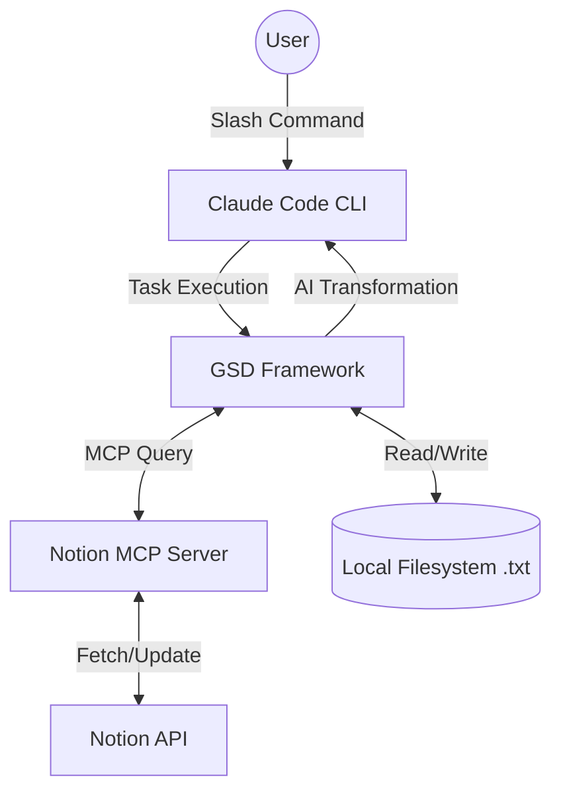

# Claude Code + Notion Workspace

A local Claude Code workspace integrated with Notion via MCP that automates data synchronization and AI-driven transformation between Notion and the local filesystem. The core pipeline reads Notion pages via MCP, saves them as `.txt` files locally, and applies non-trivial AI transformations to produce structured output back in Notion.

## Data Flow



## Prerequisites

- [Claude Code CLI](https://claude.ai/claude-code) — the primary interface and AI orchestrator
- Notion MCP Server — provides access to the Notion API; must be configured in `.claude/settings.json`
- A Notion integration token with read/write access to the target workspace
- Node.js (for running Claude Code)

## Setup

1. Clone this repository.
2. Open the project in a terminal and run `claude` to start Claude Code.
3. Ensure the Notion MCP server is configured in `.claude/settings.json` with your integration token.
4. Verify the integration has access to the Notion pages you intend to use.

## Commands

| Command | Description | Usage |
|---|---|---|
| `/notion-export` | Reads a Notion page by URL or ID via MCP and saves its content as a .txt file. The filename is derived from the page title. Auto-invoke when user asks to export, save, or download a Notion page. | `/notion-export <notion-url-or-page-id> [output-directory]` |
| `/notion-import` | Reads a local .txt file and creates or updates a Notion page with its content. Auto-invoke when user asks to import, upload, or push a local file to Notion. | `/notion-import <file-path> [--update <notion-page-id-or-url>] [--parent <parent-page-id-or-url>]` |
| `/notion-process` | Reads a Notion page via MCP, applies an AI transformation (study guide generation — summary, key concepts, and Q&A pairs), and writes the result to a new Notion page. Auto-invoke when user asks to summarize, process, transform, or generate a study guide from a Notion page. | `/notion-process <source-notion-url-or-id> [--parent <parent-page-id-or-url>]` |
| `/generate-docs` | Scans the project structure, reads all skill definitions and project files, then generates and writes a README.md to the repository root. Auto-invoke when user asks to generate, update, or write documentation or README. | `/generate-docs [--output <path>]` |

### `/notion-export`

Reads a Notion page by URL or ID via MCP and saves its content as a .txt file. The filename is derived from the page title. Auto-invoke when user asks to export, save, or download a Notion page.

**Tools used:** Read, Write, Bash, AskUserQuestion, mcp__notion__API-retrieve-a-page, mcp__notion__API-get-block-children

**Usage:** `/notion-export <notion-url-or-page-id> [output-directory]`

### `/notion-import`

Reads a local .txt file and creates or updates a Notion page with its content. Auto-invoke when user asks to import, upload, or push a local file to Notion.

**Tools used:** Read, Bash, AskUserQuestion, mcp__notion__API-retrieve-a-page, mcp__notion__API-post-page, mcp__notion__API-patch-page, mcp__notion__API-patch-block-children, mcp__notion__API-get-block-children, mcp__notion__API-delete-a-block

**Usage:** `/notion-import <file-path> [--update <notion-page-id-or-url>] [--parent <parent-page-id-or-url>]`

### `/notion-process`

Reads a Notion page via MCP, applies an AI transformation (study guide generation — summary, key concepts, and Q&A pairs), and writes the result to a new Notion page. Auto-invoke when user asks to summarize, process, transform, or generate a study guide from a Notion page.

**Tools used:** AskUserQuestion, mcp__notion__API-retrieve-a-page, mcp__notion__API-get-block-children, mcp__notion__API-post-page, mcp__notion__API-patch-block-children

**Usage:** `/notion-process <source-notion-url-or-id> [--parent <parent-page-id-or-url>]`

### `/generate-docs`

Scans the project structure, reads all skill definitions and project files, then generates and writes a README.md to the repository root. Auto-invoke when user asks to generate, update, or write documentation or README.

**Tools used:** Glob, Read, Write

**Usage:** `/generate-docs [--output <path>]`

## Project Structure

```
.
├── CLAUDE.md
├── SPEC.md
├── README.md
├── .mcp.json
└── .claude/
    └── commands/
        ├── notion-export/
        │   └── SKILL.md
        ├── notion-import/
        │   └── SKILL.md
        ├── notion-process/
        │   └── SKILL.md
        └── generate-docs/
            └── SKILL.md
```

## Rules

- ZERO COMMENTS IN CODE. Not a single line. No exceptions.
- All documentation (README.md) must be auto-generated by the `/generate-docs` skill.
- No hardcoded paths or IDs in skills.

---
_This README was auto-generated by the `/generate-docs` skill. Do not edit manually — run `/generate-docs` to regenerate._
