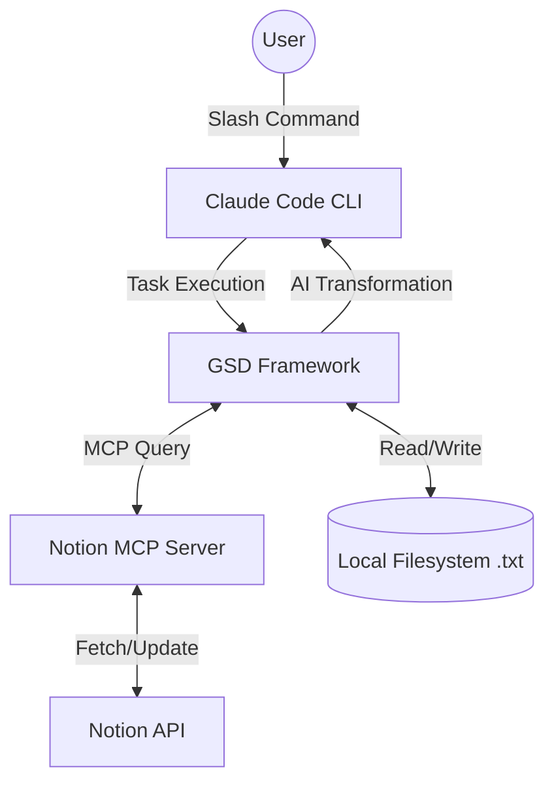

## 1. Project Overview & Component Purpose

The goal is to create an automated workflow that synchronizes and transforms data between Notion and the local filesystem using Claude Code.

- Claude Code CLI: The primary interface and AI orchestrator.
- Notion MCP Server: Provides standardized access to the Notion API without manual HTTP requests.
- GSD Framework: Ensures token efficiency by isolating tasks into clean sub-contexts, preventing "context rot."
- Local Filesystem: Acts as a persistent cache and a stage for AI-driven transformations.

## 2. Data Flow (Mermaid Diagram)

## 3. Custom Skills & Slash Commands

| Command | Action | Description |
| --- | --- | --- |
| /notion-export | Notion -> Local | Fetches page content by ID/URL and saves as Page_Title.txt. |
| /notion-import | Local -> Notion | Reads a local .txt and creates/updates a Notion page. |
| /notion-process | Notion -> AI -> Notion | Transformation: Action Item Extractor. Reads a page, identifies tasks using AI, and creates a "Meeting Minutes" summary in a new Notion page. |
| /generate-docs | Local -> Local | Scans the codebase and automatically generates README.md. |

## Phase 3: AI Transformation Pipeline

**Transformation Chosen:** Study Guide Generator (Overview, Key Concepts, and Q&A Review).
**Why:** This transformation goes beyond simple copying or summarizing. It requires semantic understanding of the source content to extract technical terms, reformulate knowledge into testable questions, and generate concise answers. It turns raw notes into an actionable and structured learning tool, which is a highly valuable, non-trivial AI task.

## 4. CLAUDE.md Structure

The CLAUDE.md file will act as the "Source of Truth" for the agent, containing:

- Project Rules: "Strictly no comments in code", "Use TypeScript for all skills".
- Context: Detailed descriptions of the local folder structure and MCP server status.
- GSD Config: Links to the active budget profile.
- Build/Test Commands: Instructions for running and verifying the custom skills.

## 5. GSD Configuration & Budget Profile

Profile Choice: eco

Reasoning: Since the trial tokens are finite, the eco profile will be used to minimize unnecessary context background. Each phase (1-5) will be run as a separate GSD task to ensure the agent doesn't carry over irrelevant logs or code from previous phases.

